# fw-policy-test

## Table of Contents
- [What](#what)
- [Why](#why)
- [Use Case](#use-cases)
- [Features](#features)
- [Design Concept](#design-concept)
- [Installation](#installation)
  - [Native Python3 Application](#native-python3-application)
  - [Docker Containerized Application](#docker-containerized-application)
- [Test Case File](#test-case-file)
  - [Sample Test Case](#sample-test-case)
  - [Test Case Format](#test-case-format)
- [Running the Application](#running-the-application)
  - [Running Docker Application](#running-docker-application)
  - [Running Docker Application with Prometheus](#running-docker-application-with-prometheus-support)
    - [Prometheus Metrics](#prometheus-metrics)
---

## What:
`fw-policy-test` is a `pytest` native application tool which can verify firewall policies. The verification process is done via connectivity tests which are performed against the target hosts inside the policy.

`fw-policy-test` tool can be dynamically configured based on the test scenarios and can be run natively as a `python3` application or as a `docker` containerized application. Since `fw-policy-test` can be run as a containerized application, it can be executed as a scheduled `k8 cronjob` in kubernetes.

For observability and monitoring purposes, `fw-policy-test` can be integrated with `prometheus` and `push-gateways` infrastructures.

## Why:
The background idea is to ensure that firewall policy compliances can be verified through a set of tests against target hosts. These set of tests can be either positive or negative tests which can easily configured in a configuration file.

## Use cases:
- Firewall policy verification tool
- Compliance test & verification tool
- Ensuring a policy is actively running against a target host/hosts
- Audit verification tool for perimeter security policies

## Features:
- Native `pytest` & `python3` application
- Containerized friendly and can be run as a `docker` image
- Can be run in `kubernetes` as a `k8 cronjob` or as an arbitrary application via `k8 job`
- Modules can be easily extended (next feature)

## Design concept:
Please find the following diagram for the architectural design of `fw-policy-test`

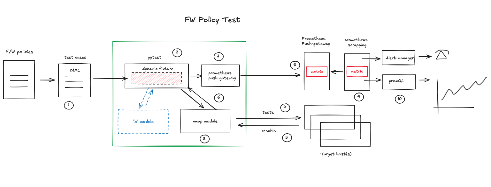

## Installation:
Installation can be done with the following steps:

Performed a `git clone` command:
```
shell> git clone https://github.com/tiskanto/fw-policy-test.git
```

and depending on how you want to run the application from you can do one of these options:

### Native python3 application

```
shell> pip install --upgrade pip setuptools
shell> pip install -r requirements.txt

```
once completed then proceed with the following:

```
shell> make test-function
shell> make run-pytest
```

### Docker containerized application

```
shell> make create-docker
shell> make run-docker
```

## Test case file:
The test case file is in `YAML` format and the test case should reflect on what tests need to be performed and the expected test results from the target host(s). 

### Sample test case:
```
---
- hostname: Linux System A
  ip_addr: 192.168.0.181
  test_set:
    - name: tcp_one
      desc: testing SSH port
      proto: tcp
      port: 22
      expected: 1
    - name: tcp_two
      desc: testing dummy TCP port
      proto: tcp
      port: 2222
      expected: 0

     --- SNIP ---

- hostname: Linux System B
  ip_addr: 192.168.0.191
  test_set:
    - name: icmp_one
      desc: testing ICMP echo
      proto: icmp
      port: 0
      expected: 0
- hostname: Linux System C
  ip_addr: 192.168.17.221
  test_set:
    - name: icmp one
      desc: testing icmp
      proto: icmp
      port: 0
      expected: 1
```

### Test case format:

| **Attribute name** | **Type** | **Description** |
| --- | --- | --- |
| hostname | string | hostname description |
| ip_addr | string | IP address of the target host |
| name | string | name of the protocol / test |
| desc | string | description what this test is for / all about |
| proto | string | protocols possible option: TCP, UDP, ICMP |
| port | integer | port of the protocol, possible option: TCP: 1-65535 / UDP: 1-65535 / ICMP: 0 |
| expected | integer | possible options: 0: blocked / 1: open / 2: open/filtered / 3: other than above |

## Running the application:


### Running docker application

The following is how to execute/run the application as a dockerized container application:

```
shell> make run-docker
```

The output:

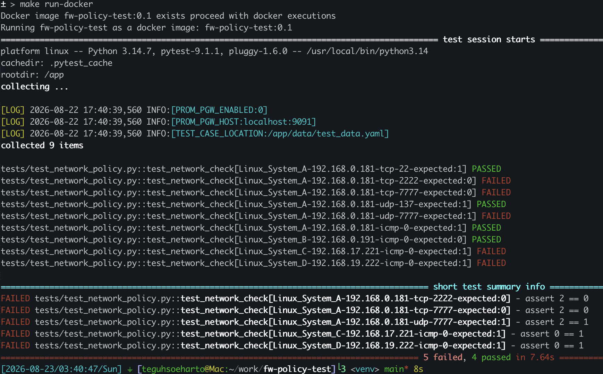

Other execution options:

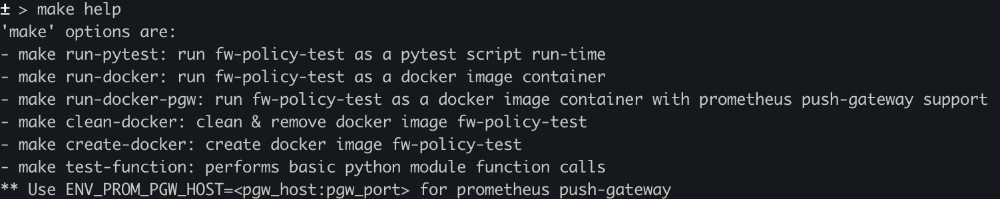


### Running docker application with prometheus support

For a more detailed implementation with `prometheus` and `push-gateway` please refer to [samples](samples) folder

```
shell> make run-docker-pgw ENV_PROM_PGW_HOST=192.168.0.223:9091
```

The output:

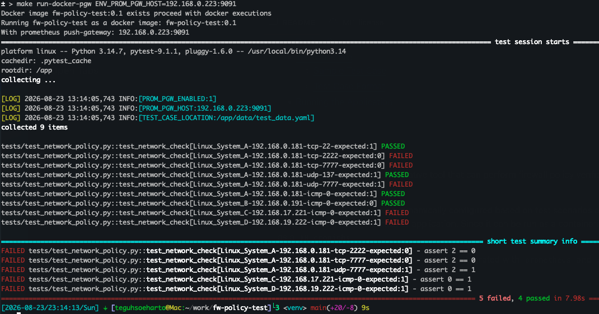

#### Prometheus metrics:

Prometheus push-gateway individual metrics

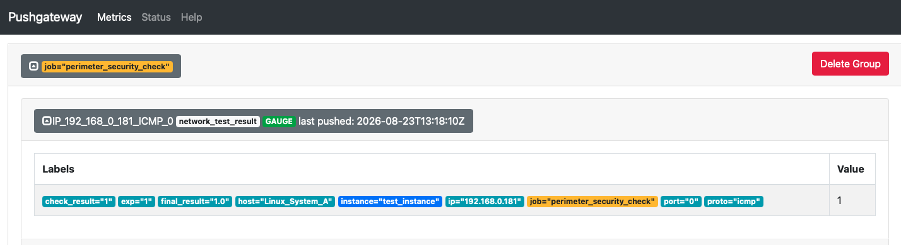

Prometheus push-gateway all metrics

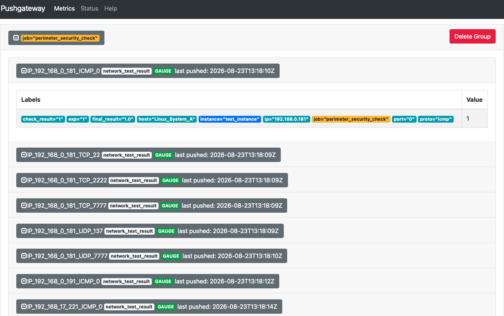

Prometheus chart failed list

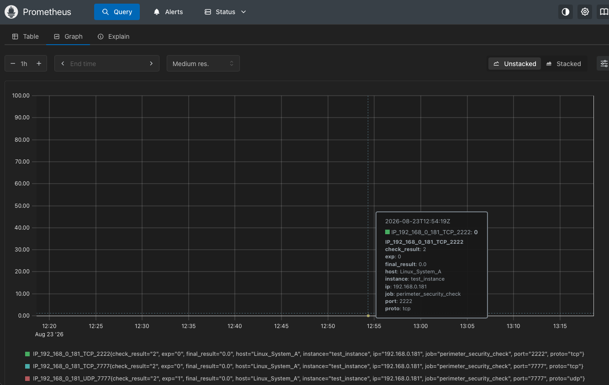

Prometheus chart failed tests - count

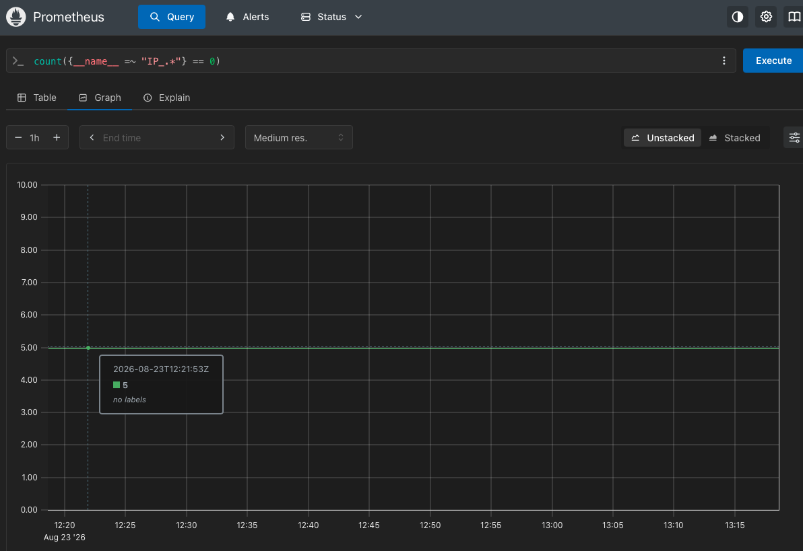

Prometheus chart success list

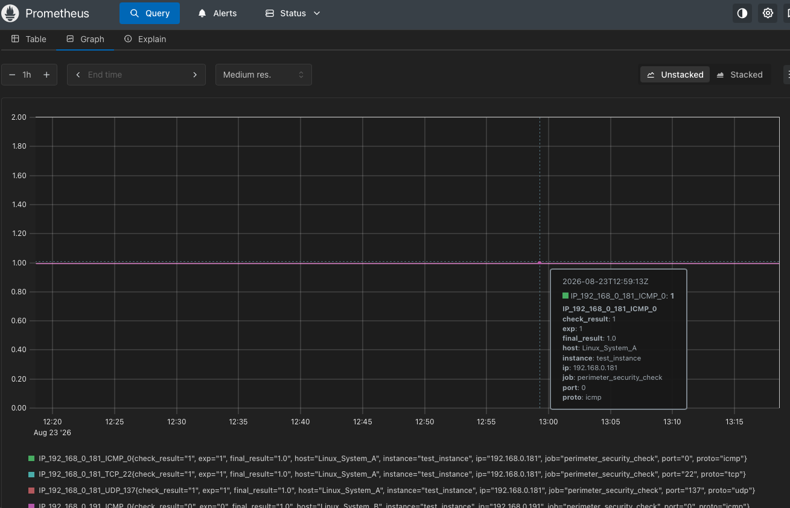

Prometheus chart success tests - count

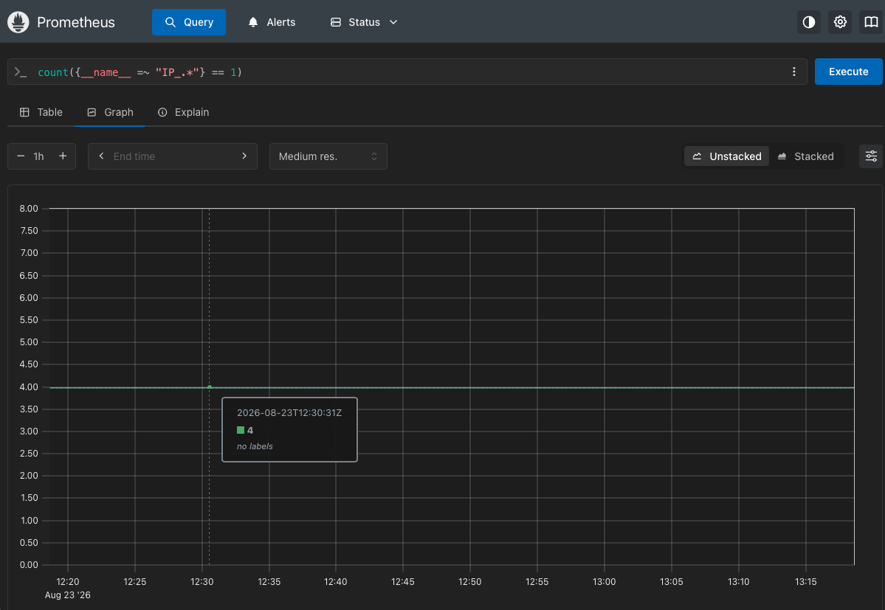

Prometheus chart total test list

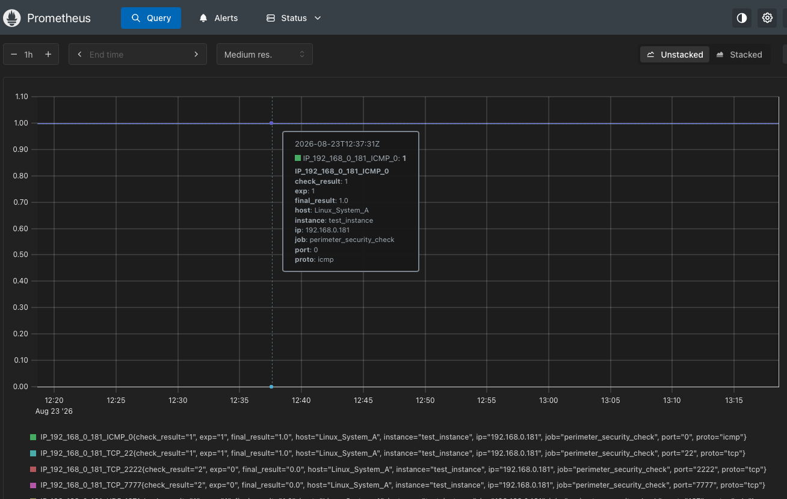

Prometheus chart total tests - count

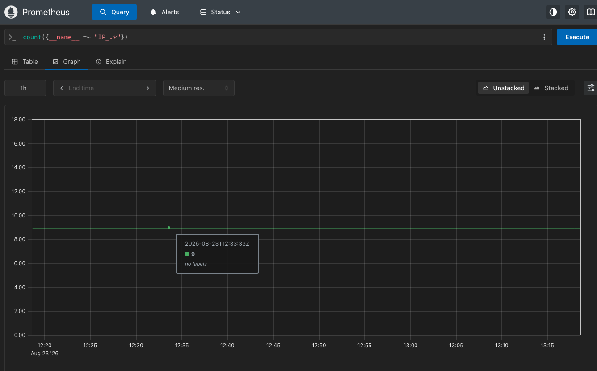
